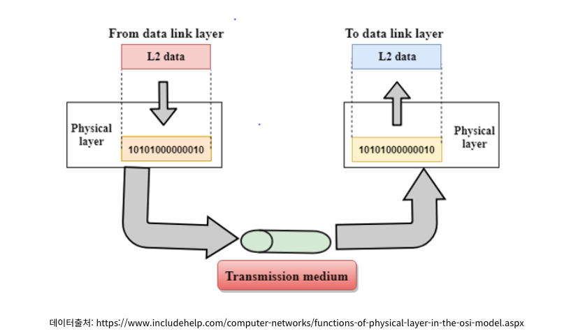
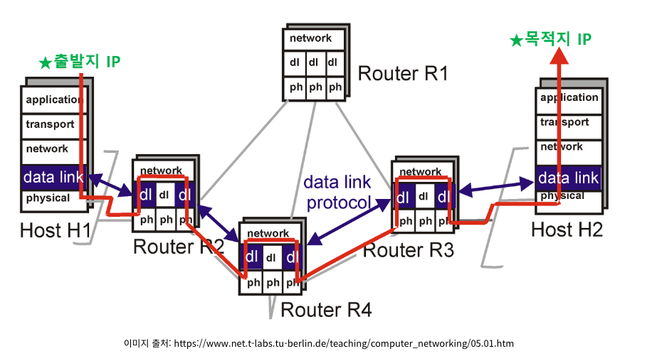

# 데이터 링크 계층을 처리하는 기기

## 1. 데이트 링크 계층이란?

데이터 링크 계층은 네트워크 계층과 물리 계층 사이에 위치하며 하드웨어, 소프트웨어 둘 다 가지고 있다. 소프트웨어로부터 정보를
전달받으면 하드웨어로 연결해주며 회선(하드웨어)로부터 데이터를 받아서 우리가 받아볼 수 있게 소프트웨어 특징을
갖는 계층으로 전달해준다.

데이터 링크 계층에선 일단 연결된 바로 이웃 컴퓨터와의 통신만을 생각하며 **직접 연결된** 서로 다른 2개의 네트워크
장치간 데이터 전송을 담당한다.

`네트워크 계층의 IP 프로토콜`이 하는 역할과 헷갈리지 않도록 하는 것이 중요하다. 데이터 링크 계층은 정말 단순히
자신과 연결된 이웃 컴퓨터로 가는 역할을 하고 네트워크 계층에선 다음으로 어느쪽으로 가는지를 정해주는 역할을 한다.

> 아파트 정문에 아파트 경비원이 서있다. 경비원은 목적지가 어디인 사람이 오면 이쪽으로 가라 저쪽으로 가라 이야기를
> 해준다. 이때 경비원이 바로 네트워크 계층의 IP 프로토콜이고 데이터 링크 계층은 그 다음 경비원까지만 안내를 한다.
> 추가적으로 사람(데이터)가 쓰러지지 않고 사고나지 않고 `언전하게 도착할 수 있도록` 안내해주는 역할도 한다.

---

## 2. L2 스위치

- L2 -> Layer2(데이터 링크 계층)
- L2 스위치 -> MAC 주소

`Switch`는 바꾸다라는 의미를 가지고 있고 `A로 가던 것을 B로 가도록 바꾸다` 이렇게 사용할 수 있다.

정리하자면 `L2 스위치`란 데이터 링크 계층, 즉 MAC 주소를 보고 데이터를 전달하는 장비이다.

- IP 주소를 이해하지 못해 IP 주소를 기반으로 라우팅은 불가능
- 단순히 패킷의 MAC 주소를 읽어 스위칭하는 역할
- 목적지가 MAC 주소 테이블에 없다면 전체 포트에 전달하고 MAC 주소 테이블의 주소는 일정 시간 이후 삭제

---

## 3. 브리지

![브리지의 역할](data:image/jpeg;base64,/9j/4AAQSkZJRgABAQAAAQABAAD/2wCEAAoHCBEPDxQPEREQERIREhEREA8PEhIPEREQGBQZGRgUHBgcJC4mHB4rHxgYJjgmKy8xNTU1GiQ7QDs0Py40NTEBDAwMEA8QHhISHDQhJCU0NDE0MTQxPzE0MTExMTYxMTQxNDQ6NDQxNDQ0PzE0MTExNDQ0NDQ0PTQ0MTQ0NDQ0NP/AABEIAMMBAQMBIgACEQEDEQH/xAAbAAEAAQUBAAAAAAAAAAAAAAAABAEDBQYHAv/EAFAQAAICAQEDCAUGCQgHCQAAAAECAAMEEQUSIQYTFjFBVJLRFBUiUWEyM0KBobQjU2JxcnN0kdIHJDRSgpOxsxdDZKSy1OI1RFVjg5Sio8H/xAAZAQEBAQEBAQAAAAAAAAAAAAAAAQIDBAX/xAAnEQEBAAIABQQCAgMAAAAAAAAAAQIRAxIhYaExQVFSIiMEEzJxgf/aAAwDAQACEQMRAD8A7NERAREQEREBERAREQPMTnHKblHtBNoPi4rtom4ErrqSx31qDk8VJPWersEh+uNv/wBTL/8AZp/BNzhWyXcc7xJLrVdUicjv5UbXxypuaxAxJVbseusNu6aj5AJ6x1e+da1kywuOt+7WOUvo9xETLRERAREQEREBERAREQEREBERAREQEREBERAREQEREBERApETE8otp+iYlt/DeVdEB7XPBft4/mESbukt1Nue7Z2qMTbtmSqiwVlRuB90EnHCEa6HTQk9nZpMp/pL/wBj/wB4/wCiajj49e4Xd6ndwGXes0dDv8dePXpr1y4uDWu+WbHYEpubuQgdE1GvDXidNZ7v6cLJv2eWZ5Teqk8quUnrLmvwPNc1zn+s5ze3938kaabv2zsgnFdjbLXKzKsdVXdJ3rWVmf8ABjidTrwOg0/ORO1Thx5JrGezrwrbu16iInB2IiICIiAiIgIiICIiAiIgIiICIiAiIgIiICIiAiIgIiIFBIO0tm05VfNXpvpqG3d5l4jqOqkGTpSNlm2u9Ctnd2/+27+KRLeSGzxkV1ij2Wrudhzt3Eq1en0vyz++bbIN/wDSqT/5eQP/AJVeU1M8vms3HHXosbL2Bi4bFserm2YbpO87nTXXT2idJloiZttvVZJPRjNqZjUvjqoUi7IWp97U6Ka3bUcevVRInKTatmKicyqu537HQgsfRal37mUAj2tN1R8XEk7ZwLcgVGqyup6bVuVrK2vQkKy7pVXQ/S98gHk6b7efzLnss5oVJ6G2Ts9FTeLNwS0k73s66sR7A4TM31/2vv8A8e9sbYsotxzUi2VOl112gL2GlAnGvQ9YD72mh1A0HEyfi5psyLaxulK68eytl4luc5zXjroR7A0kPZ2wvR/RwLSy4iZFVSlePMuy82hOv0FRV17dNeEv7M2QMa651ctXaK1rq3dOZVN87oOvFdXbQacBoOoTXynXorbl3rm10lahTYlpDAu1rMgQ69gUcSNPa169RpocvMLm7Oynya768jHRKgwFdmLZa5D6b+ri5R2cPZ4fGZqSKREShERAREQEREBERAREQEREBERAREQEREDHZ21sfHIW6wIWGqghjqPqEjdJ8HvC/ufyk3K2dRcQbKkcrwBZQ2glj1Fid2p8CzU5Ndd7YvNvppZ6TYPeE8L+UdJ8HvC/ufyl71Fid2p8CyHtPY2KlalaKlJuxgSEUcDkICPrBImp/X3S88nsvdJsLvC+F/KRLeUOGcitxeu6qXKx3X4E7mnZ8DMl6ixO7U+BZT1Fid2p8CxLw+5Znfha6T4PeE8L+UdJ8HvCeF/KXvUWJ3anwLHqLE7tT4Fk/X3X8+yz0nwe8J4X8o6T4PeE8L+UveosTu1PgWPUWJ3anwLH6+5+fZZ6T4PeE8L+UdJ8HvCeF/KXvUWJ3anwLHqLE7tT4Fj9fc/Pss9J8HvCeF/KOk+D3hPC/lL3qLE7tT4Fj1Fid2p8Cx+vufn2Wek+D3hPC/lHSfB7wnhfyl71Fid2p8Cx6ixO7U+BY/X3Pz7LHSbC7wvhfyjpNhd4Xwv5S1mbGxVsxwKKgGuZXARfaX0e06H6wD9UmeosTu1PgWP190nP2Wek+D3hPC/lHSfB7wnhfyl71Fid2p8Cx6ixO7U+BY/X3X8+yz0nwe8J4X8o6T4PeE8L+UveosTu1PgWPUWJ3anwLH6+5+fZTD23jZD83XaruQSFAYHQdfWJk5Bxtl49Tb9dNaNoQGVApk6Zut9Fx3rqrERI0REQEREBERAREQEREDzIO2Pml/aMT7zXJ0gbY+aX9oxPvNcvul9KyErKRIqkrLVrhFLH6ILH6hMBgbcXPIqrY1Hd3rQSBZ+in/63YNO08LMbZb7JbJdMtftFVbcQNa4666gGK/pEkBfrInneyW6kprHZvO9jfWAAPtMk4+OlahEUKo6gP8fifjL8bTV+UD+dDu7/AA/CVfb7U8+sdzhfW1PZvkh6vGOr+0BMjKEaybnuavtXlWBGo4g8QR2z1MVZU2LrZWNatd62heO6O10HZ7yvb2cevIpYrqGUhlIBBHEEHqIl0svtV6IlJFQNofO4369vu90nyBtD53G/Xt93uk+VmetViIkaIiICIiAiIgIiIFJHGQhUuHQou9vOGG6N0kNqergQdfdpPV9yVozu4REBZ3YhVVRxJJPACcwuto5u2sZmzW5x8gpYOUuZQmljsyk0Iu4NAw1UcD9cl7EdHzdp42Mq2X300o5AR7rEqVjproCxAPDjKY+08e1Ueq6u1LXaut6nW1HdVZioZdRwCN+6YPPzy2PiNjZN/MlzXdkbMqXaB3UqccNK7OG+FGu7+6NnlNcdUfMc+m22PZm4z4tjs+NkE6Bq6wR+ivCXXVJdsrkcocGqw1WZuHXYp3WqsyakcN7ipOoMnVXq5dVOprYK40PsuVD6fHgynh75gsx8g5Qylqc04nOVMm5+FvV9OcdF6yE3E07W9vQH2dcjss63ZZ48chDxGn/daYjViZfelYU2OihmVF32CBnZtFUa9ZJ4AdskTTuVJsyb/Ra8e+9KqXsc47Y6NVlWKUobWx0GqjnH4EkEofdM9sHPOTi13Ou5YQUvrJ1Nd6HcsT6nBETqlcmr2rm26uczJUljqq2uB9QBAE9tl5R+VmZLDUEBrXIBHEN8rrB0I+IkPZ/yD+kf+ESUZ9THh4a9Hz8s8t+r36bmd9yv763+Kb3/ACeZtt+E7XO9jLeyK7lnbc3EOmp4niTNBm7/AMmH9Bs/aW/yq5x/k4Y449I68HLK5da2vNpNlT1g7pdGRW013SQRrMfsfk/RiAMq79nba41b6vdMwJWeKWyal6PVcZbtWJHvvWtGsdlREBZndgiKANSSx6h8Zp55RVu65B2rsqt0VlGEmZXZjuG03t+07rFjuruuEG5qw3X1kVu8TUdt7Rst2euTRew13hY+zrUyaQvEMedGPY+i6daoCD16AaiNs3aFyJh2X2Zji3IdN10awsnMPuEKmPU7JroSXQaEa66aEp12luo3eY3CXmrXo+j89V8EZvbT6m4/mcDsmSkDM4X0P73srJ/JKM2n76xLEqByxynp2dfZUxR1CBXU7pXW1FOh7OBM5mmdmMA3puUNQDpztv8AFOj8vf8AsvI/9H/OSc0o+Qv6I/wnr/i4Y5S7jz8fKyzS6cvKPXmZLEHVS1rkoereHtcDoSPzEzzdtDMRS/puSdNOHO2+/wDSgyxm/Nt9X/EJ6bw8NejjM8t+rsWxbmsxKLHO870VO5PWzFFJP75PmN5O/wBAxf2bH/y1mo28srEpuDXbKDo2Uim3aQpyRuWOE1o5kjeAC6DXjw48Z8q+te+ddOgxNc2xl2CnHVGzOduYBRgjC33IqZ219JG4F0Unhx10nnAfKC4wyGvDvl2qReccWtTzFxRX9H/BnqB4e4dsEu2yxNW2i9o2hVSuflVpars1aV4bJW/Dm11aosA25d1k67h0ImX2e7G3JBLELeoUMdQq+j0nQe4akn6zE6qyMTTuUe07qspq0vyqwmILq68fGXIWy7fcaWMam3E9lRqWQdfEdY2rHs30V9VbeVW3qzvI2o11U9o90k6l6VJiIlCIiAkeyhGKMw1KNvodSN1t0rr8eDEcffJEQEj1UKrOyjQ2MHc6niwUJr8OCgcPdJEQEREDkCck9pV6quMrDU8edq4/Ee0JWzk9tFAC+OqqWVQTZUfaYhVXg/axA+udckHbHzS/tGJ95rnon8nPpHC8HHrXM+jO1O6r/e1fxzdOQ2yrsPFeu9QjvczhQyvopVB1gkfRM2eJjPjZZzVbx4cxu4pEsZVhWtmUAlVYgHqLAagTEbG5S0ZWi683Z+Lc/KP5J+l/j8JzmNstk6Ru5SXVbBNXpxtoI4Y4+Hc1bZK1X2Z+TW5ptt5zdK+jsBwSsdZ03OBm0RIrA8oNkjLpUnGw77katkTLVHrC76mxQ7I5XVQRqF90jbJ2S1NqMNm7NxVDF9/Cvff3t1kBKDHQNwdhxPDWbPKROhepIGZ7V+Og+i1lp/RVCn+Ngk8zHbP1sd8j6LgJV8alJ9v+0ST+YLKzfhF5WYNmTg3UVANY4TdUkLru2K2mp4dQM58nJfagAX0VdAABrbT/ABzrkTeHFyw/xZy4cyu65E/J7aKlQ2OoZzuoOcq9p9C2ny/6qsfqizkttN13TigA+6yn+OdO2h87jfr2+73SdOl/k5sTg47rG7PxHTCqoLtW6UV1s9e4zIyoFJXeBU6H3gj4Sx6myP8AxTaH93s3/l5monnvW7d50jD27HS2tEvtybmrcul/Oti3bxBX5WPzfYWGmn55RNjLU9Jre5glxtf0jJyMk6czZXopsZtOLjgNJmojYxtmyqGW1GrBW9t+0ksWd+Gjb2u8Cu6u6QRu6DTTQT1hYzV2XsSNLbVddCWIUU1px17dUPvmQiJ0GGz9jc9dz65OTQxrFLijmdHrDM2h30Yg+0eKkGZHGoSqta0G6iKqKupO6qjQDU8eqX4iBERArERAREQEREBERA8yDtj5pf2jE+81ydIO2Pml/aMT7zXHul9E+ViIVbYaj7DNewNgrg7tlI51wCtgbdDuvvU/RI93b2ntmxyssys3J6Vm4y3aNi5Vdqko2unBlPB1PuYHiD+eSZDycFLGDEFXHAWIxRwPdqOsfA8Jb9HvX5OQGHZz1Qc/vUrHSruz1ZCW7HVFLMQoA1LMdAB8TIvNZJ67qlH5FLbw+suR9komzl3g7s9zLxU2kFVPvCKAoPx01jUN34WDvZfAajHPym6mvH9Vfch7T29nA6zJqoUaAAADQAcABPcRaSaViIkVj9ofO4369vu10nyBtD53G/Xt92uk+Kk9arERCkREBERAREQEREBERAREQPMSsxW2tkrmKqs9iBGLA1kAnh26xJLet0l6ToykTVuhdXeMnxL5R0Lq7xk+JfKdOXD7eGebL48tpkDbHzS/tGJ95rmF6F1d4yfEvlB5FVduRkH87L5RMcPt4S5ZfHltMTVuhdX4/J8S+UdC6vx+T4l8o5cPt4ObL48tpiat0Lq/H5PiXyjoXV+PyfEvlHLh9vBzZfHltMTVuhdX4/J8S+UdC6vx+T4l8o5cPt4ObL6+W0xNW6F1d4yfEvlHQurvGT4l8pOXD7eDmy+PLaYmrdC6u8ZPiXyjoXV3jJ8S+UcuH28HNl8eW0xNW6F1d4yfEvlHQur8fk+JfKXlw+3g5svjyze0Pncb9ob7tdJ01Y8iquH84yOHV7S+UdC6u8ZPiXyjlw+3g5svjy2mJp2PyTrd7VN+QObsVBoy8Qa0fjw97mSOhdXeMnxL5Rccft4Jllfby2mJq3QurvGT4l8pew+SldNq2i69ijBgrMuh/PwkuOOul8LLl8eWyxETDZERAREQEREBERAREQEREBERAREQEREBLD2oHVCyhnDFVJAZgNNSB26aj98vzW9u59ONnYdl91VCc3mLv3WLUmpFWg1YgayW6GasyERlVnRWsYrWrEKzsFJIUHrOgY8OwR6VXzvM84nOFS4q3hvlAdC+717upA16ppW2Mq3Lue/ExrctMVavQ8jGtxeaOTvJdZ7TuCVKCtNVDcGsHwk6xRmZi5NDaOMLGyMZzwGpe32W/JZSVPwPvAj42VtNdqsWCsGKNuuAQd1tAdD7joQdPjI9e08drzjDIpN6jVscWIbgNNdSmuo4EHq7ZjuTOULvSrAGXey2BRxoyOKagyn4ggj6pFXa+HlZqUJkYoONe7CvnaxfblAOjqteu8AN5yTp7R6uGpKJPfs2uIiVSIlIEDA+eyP1yfd65PEgYPz2R+tT/Irk6Kk9HqIiFIiICIiAiIgIiICIiAiIgIiICIiAiIgIiICIiAiIgIiICIiB4M5bs7bm2s5nOM4YIQXVUxlCb2ugG+NT1H39U6fYwVSzEAAEsSdAAO2cf5KcpfVvO/gee53m/wDWc3u7u9+Sddd77J14WO8bZN3o5Z3Vm7qM6lXKFWZgOLkM5/mXFgAo+wCR8TlFtOraFWLk2DU21V2VlKDwcp2oPc2vAyZ/pL/2P/eP+ia8m0vTNsU5O5uc5k4vsb2/u7hROvQe7XqnSY5XfNjJ0YtxmtWuzRKSs8z0EREBERAREQEREBERAREQEREBERAREQEREBERAREQEREBERA1P+UDaXo+Ea1Oj5Dc0NOxOt/s4f2pzqpsdECc5WxJR2Zq21HA6qDu66Ts2Tg1XgC6uu0A6gWojgH4aiR/UOF3TF/uKvKduHxZhNacs+HcrvbkIGOibvO0v7Zb5qwP1HRQd3q1IOnwmZ5DbNGTnC0hWrxlVt5UCBrPo8NPfqf7E6J6hw+6Yv8AcVeUk4uHVQCtVddQJ1ZakVAT7yAJrPj82NkjOPC1d1LiInndyIiAiIgIiICIiAiIgIiICIiAiIgIiICIiAiIgIiICIiAiIgIiICIiAiIgIiICIiAiIgf/9k=)  

- 두 개의 근거리 통신망(LAN)을 상호 접속할 수 있도록 하는 통신망 역할
  - 브리지가 생기면 이동할 수 있는 MAC 주소가 추가되어 이정표가 생기는 것이다.(?)
- 포트와 포트 사이의 다리 역할
- 장치에서 받아온 MAC 주소를 MAC 주소 테이블로 관리
- 통신망의 범위와 길이를 확장할 때 사용
- 통신망에 더욱 많은 컴퓨터들을 연결시킬 때 사용
- 통신망에 과다하게 연결된 컴퓨터들로 인한 병목현상을 줄이고자 할 때 사용

---

## 참고

[[네트워크 OSI] 2계층 데이터링크 계층 Data Link Laye가 뭔지 궁금해?! 쉽게 설명해줄게~!](https://jhnyang.tistory.com/403?category=947031)  
[[아주 쉽게 설명] L2, L3, L4 스위치를 한 방에 설명](https://doctorson0309.tistory.com/575)  
[브리지(bridge)](https://sites.google.com/site/kuresitmemo/network/bridge)
