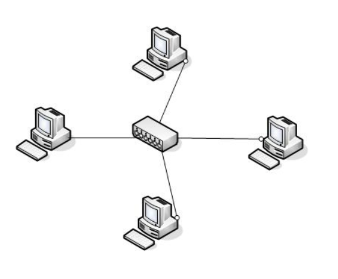

# 물리 계층을 처리하는 기기

## 1. 물리 계층이란?

> 물리 계층은 OSI 7계층 중 맨 아래 단계에 있는 제 1계층으로 전기적 특성을 이용해 신호를 만든다.

네트워크란 멀리 떨어진 누군가와 소통을 할 수 있게 도와주는 역할을 한다. 즉, 통신을 도와주는데 이런 통신이
가능하려면 중간에 매체가 필요하다. 통신에 있어 우리가 흔히 사용하는 매체는 전도성이 좋은 구리이다.

이런 통신에 필요한 매체를 통해 전기 신호를 서로 주고 받으며 데이터의 이동이 일어나게 된다.

여기 전기 신호는 전기가 흐흔다, 전기가 흐르지 않는다 이 두 가지 밖에 없으므로 컴퓨터 언어는 이진수체계라고 부른다.
즉, `1`과 `0` 두 가지 만으로 인터넷을 통해 다른 사람과 소통이 가능해진다.

이런 이진 데이터정보를 신호로 바꾸어 멀리 있는 사람과 통신을 할 수 있는지를 고민하고 설계하는 계층이 바로
물리 계층이다.

---

## 2. NIC(Network Interface Card)

- 네트워크 인터페이스 컨트롤러는 컴퓨터를 **네트워크**에 연결하여 통신하기 위해 사용하는 하드웨어 장치
- 네트워크 카드, 랜 카드, 물리 네트워크 인터페이스 등이라고 불림
- OIS 계층 1과 계층2 장치를 가짐
- MAC 주소를 사용하여 낮은 수준의 주소 할당 시스템을 제공하고 네트워크 매개체로 물리적인 접근을 가능하게 함
- 사용자들이 케이블을 연결하거나 무선으로 연결하여 네트워크에 접속할 수 있음
- 이전에는 보통 확장 카드로 따로 설치하였지만 요즘에는 대게 메인보드에 내장되어 쓰는 경우가 많음
- 자료 전송시
  1. CPU는 메모리에 패킷을 형성
  2. NIC는 자료전송을 시작
  3. 자료 전송을 마칠경우 인터럽트로 CPU에 통보
- 자료 수신시
  1. CPU 메모리에 버퍼공간을 할당
  2. NIC는 퍼퍼에 수신되는 자료를 저장
  3. 수진 종료시 인터럽트로 CPU에 통보

> 패킷: 정보 기술에서 패킷 방식의 컴퓨터 네트워크가 전달하는 데이터의 형식화된 블록

---

## 3. 리피터(Repeater)

- 근거리 통신망을 구성하는 세그먼트들을 확장하거나 서로 연결하는데 주로 사용
- 신호를 수신하여 신호를 증폭한 후 다음 구간으로 재전송하는 장치
- 여러 대의 리피터를 써서 신호를 먼 거리까지 데이터를 전달하는 것이 가능
- 광케이블이 보급됨에 따라 현재는 잘 쓰이지 않음

---

## 4. 허브(Hub)

- 다수의 pc와 장치들을 묶어서 LAN을 구성할 때 각각의 PC에 연결된 노들을 한곳으로 모으는 역할을 해주는 장치
- 중식축에 놓여 여러 컴퓨터들을 연결해 네트워크를 만들어주는 역할
- 컴퓨터 b가 컴퓨터 c로 신호를 보내면, 그 신호는 c한테만 가는게 아니라 연결된 모든 컴퓨터로 전송함

---

## 5. AP(Access Point)

- 무선랜 서비스를 제공하는 소형 무선 단말기
- 인터넷 공유기는 AP의 한 종류
- AP에 유선 LAN을 연결한 후 다른 장치에선 무선 LAN 기술(와이파이)을 사용할 수 있음

---

## 참고

[[네트워크 OSI 7계층] 1계층 물리계층에 대해 살펴보자. Physical Layer 피지컬계층!](https://jhnyang.tistory.com/373?category=947031)  
[위키백과 - 네트워크 인터페이스 컨트롤러](https://ko.wikipedia.org/wiki/%EB%84%A4%ED%8A%B8%EC%9B%8C%ED%81%AC_%EC%9D%B8%ED%84%B0%ED%8E%98%EC%9D%B4%EC%8A%A4_%EC%BB%A8%ED%8A%B8%EB%A1%A4%EB%9F%AC)  
[서버 구조의 이해 NIC](https://startingpitcher.tistory.com/3)  
[[네트워크 #10] 허브란? 스위치란? 리피터란?](https://m.blog.naver.com/soojin_2604/221963899838)  
[리피터란?](https://m.blog.naver.com/PostView.naver?isHttpsRedirect=true&blogId=ahnsh09&logNo=40168530159)  
[나무위키 - AP](https://namu.wiki/w/AP)
